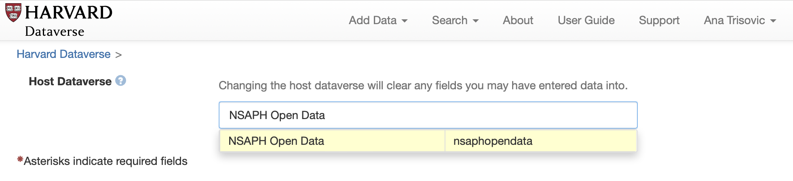

# Dataverse

There are three NSAPH collections at [Harvard Dataverse](https://dataverse.harvard.edu):

- General: [https://dataverse.harvard.edu/dataverse/biostats](https://dataverse.harvard.edu/dataverse/biostats)
- Open data collection: [https://dataverse.harvard.edu/dataverse/nsaphopendata](https://dataverse.harvard.edu/dataverse/nsaphopendata)
- Analysis data collection: [https://dataverse.harvard.edu/dataverse/nsaphanalysis](https://dataverse.harvard.edu/dataverse/nsaphanalysis)

## Uploading data to NSAPH Dataverse collection

There are two ways to upload data to a NSAPH Dataverse collection. 

### Upload within the collection

The first is:

1. Navigate to one of the NSAPH collections: [NSAPH Open Data](https://dataverse.harvard.edu/dataverse/nsaphopendata), 
[NSAPH Analysis data](https://dataverse.harvard.edu/dataverse/nsaphanalysis) or 
[NSAPH General](https://dataverse.harvard.edu/dataverse/biostats).
2. Within the collection, click "Add Data" > "New Dataset" (see figure):


### Upload from the main page

Another way to upload data to a NSAPH Dataverse collection is by selecting the collection at upload:

1. On the main [Harvard Dataverse](https://dataverse.harvard.edu) page, click "Add Data".
2. Next, specify the Host Dataverse (i.e., the collection) name in the upload form like in the figure below:



```{note}
For additional guidence on data upload, please see documentation here: https://support.dataverse.harvard.edu/getting-started
```