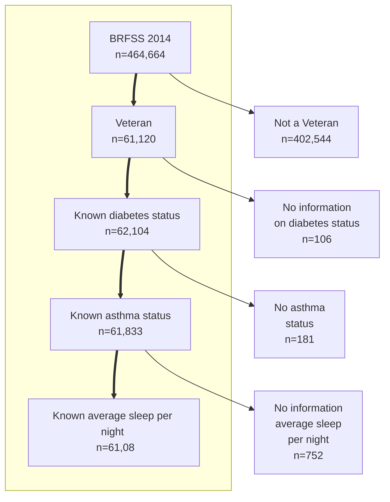
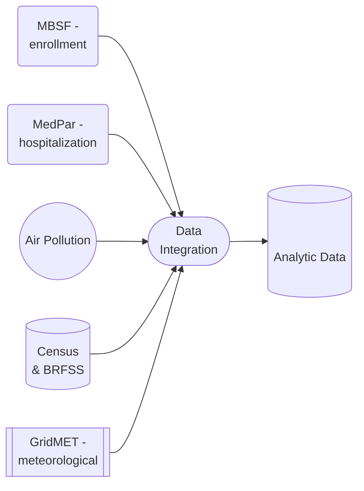

# Documentation

This section will give you some general guidelines on documenting your analysis data and code.

## Data diagrams

Data diagram tools like  [Mermaid](https://github.com/mermaid-js/mermaid#readme) and [PlantUML](https://plantuml.com) 
are useful to document data processing flows and some can be embedded into Markdown files such as a `README.md` file.

By using diagram tools:
* modifications to flowcharts do not have to be re-uploaded with new images every time.
* Markdown syntax is intuitive therefore documentation process is more efficient. 

```{tip}
You may reuse the following source code examples to document your GitHub project repository.
Add the source code in your `README.md` file and make changes to it to document your data flow.
```

Examples of Data Filtering and Data Integration diagrams created by `mermaid`.
Documenting data selection (rendered diagram):

```{figure} imgs/process_flow.png
---
scale: 40%
align: center 
---
Example data process flow diagram
```

Source code of the diagram for the Markdown file:
````

````

Documenting data sources (rendered diagram):

```{figure} imgs/data_integration.png
---
scale: 40%
align: center 
---
Example data integration diagram
```

Source code of the diagram for the Markdown file:
````

````

See [more examples](https://github.com/NSAPH-Data-Processing/sql-utils/tree/main/docs) on Github.

## Data dictionary

A data dictionary is important to communicate to other data users about the content of your data. When you have many variables in your dataset, you can create a dictionary that shows what each variable represents, what data type it is stored as (string, int, etc.), and any other pertinent information, such as what the missing values are encoded as. If you are including a measure as one of your variables, you should include the units of the measure (e.g. grams, degrees Celsius, etc.) in your data dictionary. Below is an example of what a few rows of a data dictionary may look like.

| Variable      | Description |
| ----------- | ----------- |
| UserID      | An 8 digit integer containing the user ID for each individual |
| DOB  | The user's date of birth, encoded as MMDDYYYY. Missing values are encoded as "99999999"  |
| WGT | An integer containing the user's weight in kilograms. Missing values are encoded as "-1" |
|  CVD_HSP_PST_YR | A binary variable which states whether the individual has been hospitalized for cardiovascular disease in the past year. |

```{tip}
View an example of a data dictionary here: https://github.com/ShuxinD/ADRDdata#data-dictionary
```

## Code documentation

A `README.md` file is a standard documentation file where you should put information about the content of your repository.

Consider adding some of these standard sentences in your README.md file (change them as needed):

````{card}
Software requirements
^^^
- We use the R version: 4.x.y
- We use Python 3.x.y
- You can execute this code in RStudio 
- You can execute this code in the command line as follows:

```
RScript analysis.R
```
````
````{card}
Data Availability
^^^
All data are publicly available. / 
Some data cannot be shared publicly. / 
No data can be shared publicly.

We use data from the following data sources:
1. List data sources.
2. Medicare/Medicaid. It cannot be shared, but 
you may find synthetic data from CMS 
[here](https://www.cms.gov/Research-Statistics-Data-and-Systems/Downloadable-Public-Use-Files/SynPUFs/DE_Syn_PUF).
````


