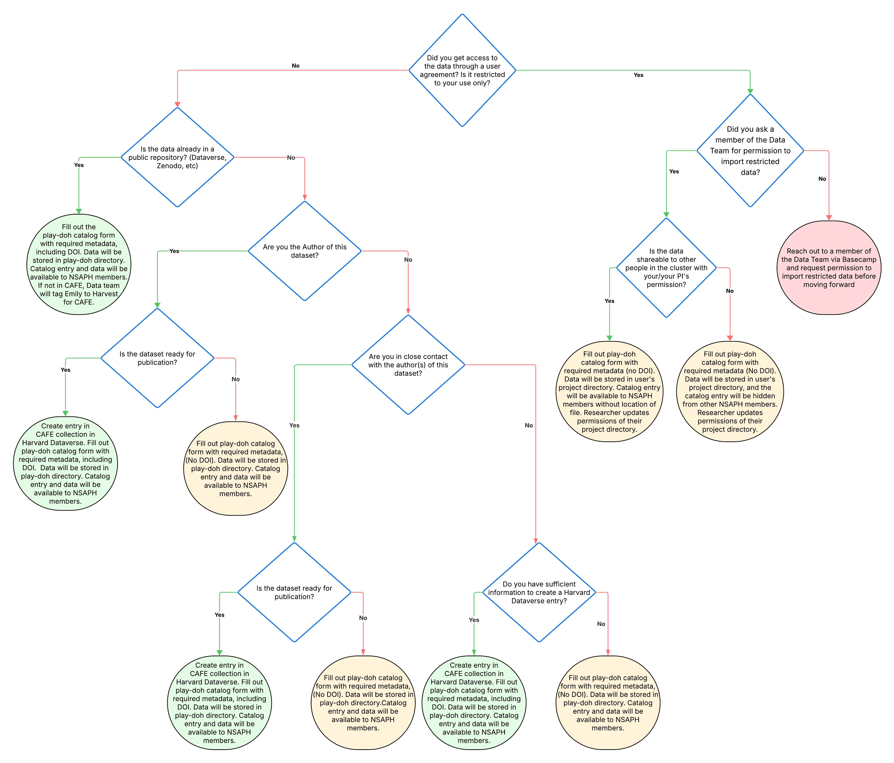

# Data Intake Form

The `data/play-doh/` folder in the ReD lab share is an unstructured data repository housing datasets that do not conform to the [LEGO](lego_data_model.md) standards. This space primarily stores data that has been imported into ReD by NSAPH members. This page describes how to navigate the data intake form for importing data into ReD using the [data intake form](https://docs.google.com/forms/d/e/1FAIpQLScJ-hkr3GrqJVf-g8wN9veyvCTb_AWweDzteSGiXo2q29b39Q/viewform?usp=header). 

> ⚠️ **All import requests must go through the [data intake form](https://docs.google.com/forms/d/e/1FAIpQLScJ-hkr3GrqJVf-g8wN9veyvCTb_AWweDzteSGiXo2q29b39Q/viewform?usp=header).**
>
> If you need help filling it out, please reach out to a member of the Data Team via Basecamp.

## Filling out the Form
### Decision Tree

Use the decision tree below to determine whether you need to create a Dataverse entry, where your data will be stored on ReD, and if/how the data will be shared with other NSAPH members




#### Examples

The following examples reflect the kinds of datasets researchers commonly bring into ReD. Each one shows the path taken through the decision tree, what to do in the intake form, and where the data ends up.

````{admonition} Example 1: Riley creates a new Harvard Dataverse deposit
:class: tip

Riley assembled a dataset linking National Weather Service heat alerts to county boundaries. The paper using it has been published, and the dataset is ready to be shared, but it is not yet in any public repository.

```text
Did you get access through a user agreement / restricted to your use only?  → No
└── Is the data already in a public repository?                             → No
    └── Are you the author of this dataset?                                 → Yes
        └── Is the dataset ready for publication?                           → Yes
            └── ✅ Create an entry in the NSAPH subcollection of CAFE in Harvard Dataverse,
                   then fill out the intake form with the required metadata, including the DOI
```

Riley starts the intake form, and after the publication question, the form shows the Harvard Dataverse deposit instructions and ends. Riley submits it, creates a deposit in the NSAPH subcollection of the CAFE Dataverse, and submits the draft for publication to receive a DOI. Riley then fills out the intake form again, this time answering that the dataset is already in a public repository and entering the new DOI.

**Result:** the data is stored in `data/play-doh/`, and the catalog entry and data are available to NSAPH members.
````

````{admonition} Example 2: Jordan has hospital records that others can use with permission
:class: tip

Jordan received statewide hospitalization records from a state health department under a data use agreement. The agreement allows other researchers to work with the data, but only after they get approval from Jordan's PI and the health department.

```text
Did you get access through a user agreement / restricted to your use only?  → Yes
└── Did you ask a member of the Data Team for permission to import?         → Yes
    └── Is the data shareable with your/your PI's permission?               → Yes
        └── ✅ Fill out the intake form with the required metadata (no DOI)
```

Before doing anything else, Jordan messages the data team on Basecamp and gets the go-ahead to import restricted data. In the intake form, Jordan gives the path to the project directory, describes how to request access from the PI and the health department, and enters N/A for the DOI. After the import, Jordan updates the project directory's permissions.

**Result:** the data is stored in Jordan's project directory. The catalog entry is available to NSAPH members without the location of the files, so others know the data exists and who to ask for access.
````

````{admonition} Example 3: Alex built a dataset that is not ready to publish yet
:class: tip

Alex built a county-level heat exposure dataset from public weather station data for a paper that is still under review. The data itself is not sensitive, but Alex wants to wait until the paper is accepted before publishing the dataset.

```text
Did you get access through a user agreement / restricted to your use only?  → No
└── Is the data already in a public repository?                             → No
    └── Are you the author of this dataset?                                 → Yes
        └── Is the dataset ready for publication?                           → No
            └── ✅ Fill out the intake form with the required metadata (no DOI)
```

Alex transfers the files through Globus and fills out the intake form, entering N/A for the DOI and linking the GitHub repository with the processing code.

**Result:** the data is stored in `data/play-doh/`, and the catalog entry and data are available to NSAPH members.
````

## Data Import Steps

**Step 1** Follow the decision tree above to determine which case applies to your dataset. If your data is restricted, do not continue until a member of the data team has granted permission to import it.

**Step 2** If the decision tree indicates that you should create a [Harvard Dataverse](https://dataverse.harvard.edu) entry, create it in the NSAPH subcollection of the [CAFE Dataverse](https://dataverse.harvard.edu/dataverse/cafe) following the [CAFE data management guidelines](https://climate-cafe.github.io/intro.html). If your dataset is already under another collection, please let the data team know so the dataset is linked into the CAFE collection.

NOTE: If you reach a Harvard Dataverse deposit page in the intake form, the form will end there. Do not submit the form. create your Dataverse deposit, and once you have a DOI, fill out the intake form again, this time answering that your dataset is already in a public repository and providing the DOI. Similarly, if your data is restricted and you have not yet received permission from the data team, the form will end early; come back and complete it once permission is granted.

**Step 3** Using Globus, create a subfolder named with your username (for example, `jharvard`) within the `/import/` directory and transfer the data that needs to be imported into this folder. See the Globus user guide at ReD Sharepoint site > Documents > ReD-File Transfers with Globus.

NOTE: If you are using Globus for the first time, please notify either [Shreya Nalluri](mailto:snalluri@hsph.harvard.edu) and/or [Mahima Kaur](mailto:mahimakaur@hsph.harvard.edu) with your Globus ID so you can be added to the NSAPH collection.

**Step 4** Once the data transfer is complete, fill and submit the [data intake form](https://docs.google.com/forms/d/e/1FAIpQLScJ-hkr3GrqJVf-g8wN9veyvCTb_AWweDzteSGiXo2q29b39Q/viewform?usp=header) with the required metadata (including the DOI, if applicable) so the data team can proceed with the importation process.

>**What Happens After Submission?**
>The data team will:
>* Review the Dataverse entry (if applicable) and associated metadata, and confirm that the dataset meets applicable data standards and Play-Doh requirements.
>* Move the data to its final location on ReD: the `data/play-doh/` directory, or your project directory for restricted data.
>* Add the dataset to the [Play-Doh catalog](https://docs.google.com/spreadsheets/d/1IPhl_-Zgn6EkWPpUkARkzNNW82RZDArxXJ98XPpm4JQ/edit?resourcekey=&gid=615500760#gid=615500760) with the appropriate visibility and update the data location in the intake form accordingly.